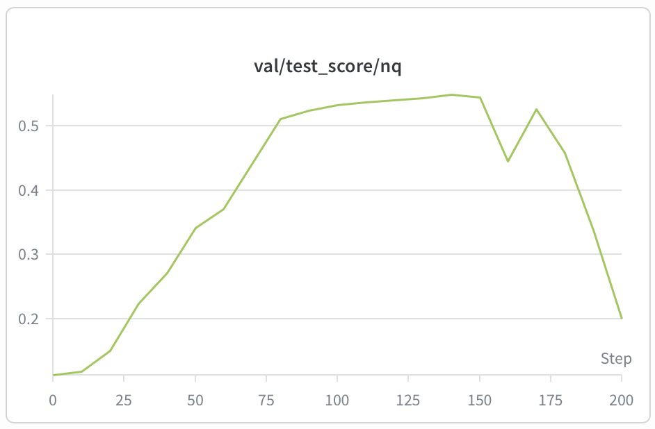
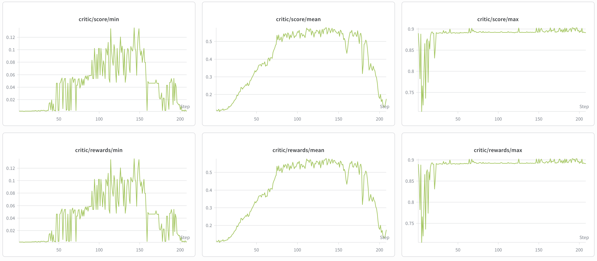
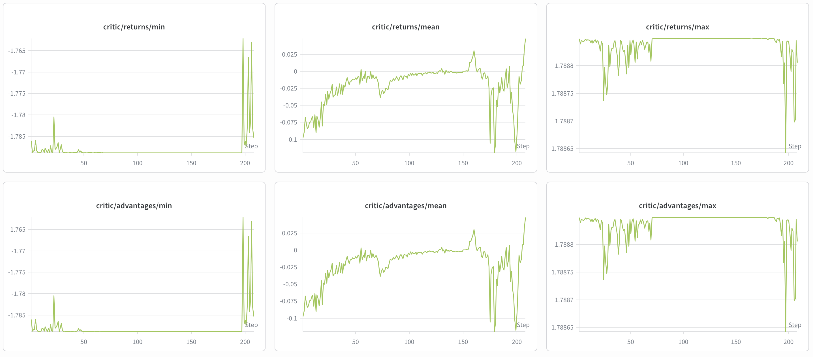
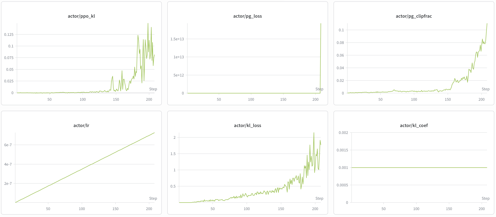
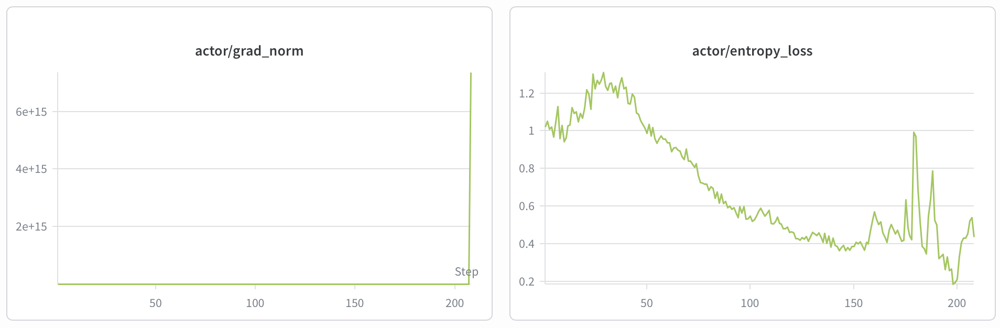
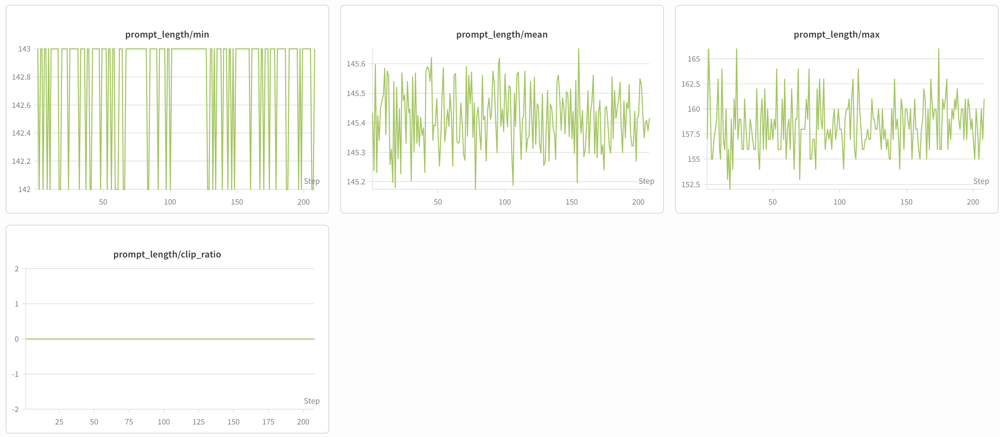
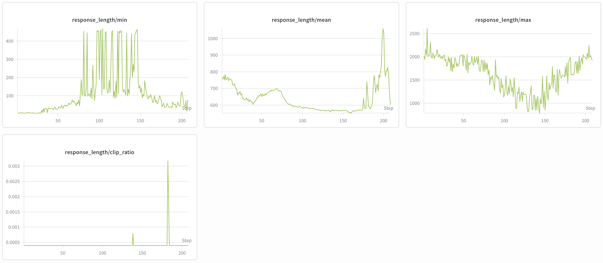
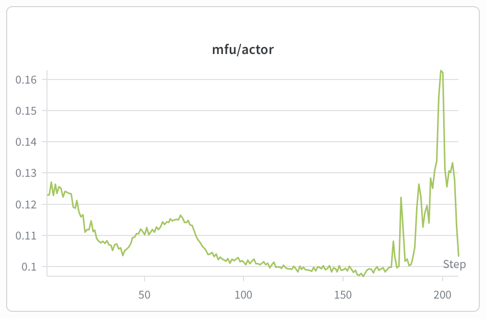

# SearchRL 实验报告

## 摘要

本项目在 Search-R1 代码库基础上构建 SearchRL，主要完成两类改进：一是解除原始工程对 `flash-attn` 与 `vllm` 的硬依赖，使训练可以在未安装这两个高约束包的环境中运行；二是将原有二元 Exact Match 奖励扩展为 5 维 Rubric 奖励，为检索增强强化学习提供更连续、更可解释的过程监督信号。

在 NQ Search 任务上的 GRPO 训练实验中，监测结果显示 `val/test_score/nq` 从训练初期约 0.11 提升至最高 0.54854，`critic/score/mean` 最高达到 0.578。中期训练阶段 reward 与验证分数同步上升，说明 SearchRL 的奖励设计能够提供有效优化信号；后期 actor KL、clip ratio 与响应长度显著上升，并伴随验证分数回落，提示最佳模型应选择验证峰值附近的 checkpoint，而不是最终 checkpoint。

## 1. 背景与目标

Search-R1 通过强化学习训练大模型在回答问题时主动搜索、读取检索文档并给出答案。原始代码库在工程和奖励设计上存在两类限制：

| 问题 | 原始 Search-R1 表现 | SearchRL 改进目标 |
| --- | --- | --- |
| 依赖约束强 | `flash-attn` 与 `vllm` 为高耦合依赖，容易受操作系统、CUDA、PyTorch 和显卡架构限制 | 将高性能依赖改为可选项，默认使用 PyTorch/HuggingFace 路径保证可运行 |
| 奖励稀疏 | 主要依赖 Exact Match，答案错误时 reward 易为 0 | 引入多维连续奖励，显式建模搜索质量、检索利用和最终答案质量 |
| 过程不可解释 | 奖励只反映最终答案，不反映搜索 query 与文档使用情况 | 输出可拆解的 5 维过程分，便于定位训练问题 |
| 部署弹性不足 | 默认强绑定特定推理后端 | 支持 HF rollout 与 vLLM rollout 切换，适配单机和集群环境 |

本次实验目标是验证 SearchRL 能否在保留 Search-R1 检索增强 RL 框架的同时，提高工程可部署性，并通过 Rubric 奖励获得可观测、可优化的训练信号。

## 2. 方法设计

### 2.1 依赖与注意力后端解耦

SearchRL 在配置文件中新增 `attn_implementation`，默认值为 `sdpa`。这意味着模型默认使用 PyTorch 内建注意力，不再要求必须安装 `flash-attn`。

关键改动包括：

| 模块 | 改动 |
| --- | --- |
| `verl/trainer/config/ppo_trainer.yaml` | `actor_rollout_ref.model`、`critic.model`、`reward_model.model` 增加 `attn_implementation: sdpa` |
| `verl/trainer/config/sft_trainer.yaml` | 增加 SFT 场景下的注意力后端配置 |
| `verl/workers/fsdp_workers.py` | 从配置读取 `attn_implementation`，仅在选择 `flash_attention_2` 时应用相关 monkey patch |
| `verl/trainer/fsdp_sft_trainer.py` | 同步改为从配置读取注意力实现 |

可选后端如下：

| 后端 | 是否需要 `flash-attn` | 适用场景 |
| --- | --- | --- |
| `sdpa` | 否 | 默认训练路径，兼容性最好 |
| `eager` | 否 | 调试路径 |
| `flash_attention_2` | 是 | 已成功安装 FlashAttention2 的高性能环境 |

### 2.2 `flash-attn.bert_padding` 的纯 PyTorch 替代

SearchRL 新增 `verl/utils/bert_padding.py`，提供 `unpad_input`、`pad_input`、`index_first_axis` 的纯 PyTorch 实现，用于替换原先来自 `flash_attn.bert_padding` 的函数。这样即使环境中不存在 `flash_attn`，`use_remove_padding` 相关路径也不会因导入失败而中断。

依赖文件中也将 `flash-attn` 注释为可选依赖，并显式增加 `einops`，避免依赖由 `flash-attn` 间接提供。

### 2.3 推理后端可切换

`ppo_trainer.yaml` 将 `actor_rollout_ref.rollout.name` 默认设置为 `hf`，即通过 HuggingFace `model.generate()` 执行 rollout。该路径无需安装 `vllm`，适合单卡或小模型调试。

同时，原有 vLLM 路径仍保留。集群或多卡高吞吐场景可以将 `rollout.name` 切回 `vllm`，并配置 tensor parallel 与显存占用参数。实验部署记录中还包含 7+1 GPU 分离方案：训练/评估使用 7 张 GPU，检索服务单独占用 1 张 GPU。

### 2.4 自定义奖励函数机制

SearchRL 在 `verl/utils/import_utils.py` 中新增 `load_extern_function(path, name)`，并在 `main_ppo.py` 与 `main_ppo_format.py` 的 `RewardManager` 中接入 `custom_reward_function`。

当配置中存在：

```yaml
custom_reward_function:
  path: reward_functions/rubric_merged.py
  name: compute_score
```

训练时会动态加载 `reward_functions/rubric_merged.py:compute_score`。如果该配置不存在，则回退到原始 `qa_em` 奖励。`RewardManager` 会将样本中的 `reward_model` 字典作为 `extra_info` 传给奖励函数，因此可以通过数据字段覆盖权重、EM Gate 衰减系数等参数。

## 3. 5 维 Rubric 奖励

原始 EM 奖励只判断最终答案是否完全匹配，难以评价检索 query 是否有效、模型是否利用检索文档、推理过程是否支撑答案。SearchRL 的 Rubric 奖励将一次 rollout 拆解为 5 个维度：

| 维度 | 权重 | 评价目标 | 实现文件 |
| --- | ---: | --- | --- |
| D1 Query 质量 | 0.15 | query 长度、与问题相关性、是否直接复制问题 | `reward_functions/dim1_query_quality.py` |
| D2 重复搜索惩罚 | 0.15 | 多轮 query 间是否高度重复 | `reward_functions/dim2_repetition.py` |
| D3 检索结果利用度 | 0.20 | `<information>` 文档内容是否被 thinking/answer 使用 | `reward_functions/dim3_doc_utilization.py` |
| D4 推理逻辑一致性 | 0.15 | `<think>` 是否支撑 `<answer>`，推理长度是否合理 | `reward_functions/dim4_consistency.py` |
| D5 答案 F1 | 0.35 | SQuAD token-level F1，支持部分正确答案 | `reward_functions/dim5_answer_f1.py` |

合并奖励位于 `reward_functions/rubric_merged.py`：

```text
process_score = 0.15 * D1 + 0.15 * D2 + 0.20 * D3 + 0.15 * D4
answer_score  = 0.35 * D5
final_reward  = process_score + answer_score
```

当 D5 的答案 F1 为 0 时，Rubric 使用 EM Gate 将过程分衰减到 30%：

```text
final_reward = answer_score + process_score * 0.3
```

该设计避免错误答案获得过高过程奖励，同时保留弱梯度信号，缓解训练早期全零 reward 的问题。

## 4. 实验设置

本次实验围绕 NQ Search 问答任务展开，训练框架沿用 Search-R1/verl 的 PPO/GRPO pipeline。

| 项目 | 设置 |
| --- | --- |
| 数据集 | NQ Search，验证指标为 `val/test_score/nq` |
| 基座模型 | Qwen2.5-3B 系列配置 |
| 强化学习算法 | GRPO |
| 每个 prompt 采样数 | `actor_rollout_ref.rollout.n_agent=5` |
| 检索服务 | 本地 FastAPI 检索服务，`retriever.topk=3` |
| 检索格式 | `<search>` 触发检索，结果写入 `<information>` |
| 生成格式 | `<think>`、`<search>`、`<information>`、`<answer>` |
| 奖励函数 | `reward_functions/rubric_merged.py:compute_score` |
| 默认兼容路径 | `attn_implementation=sdpa`，`rollout.name=hf` |
| 集群加速路径 | 可切换 `rollout.name=vllm`，并使用 7+1 GPU 分离部署 |

监测结果来自 `results/` 目录中的 W&B 曲线截图与 `max.txt`。

## 5. 实验结果

### 5.1 核心数值

| 指标 | 结果 | 说明 |
| --- | ---: | --- |
| `val/test_score/nq` 最大值 | 0.54854 | NQ 验证集最高测试分数 |
| `critic/score/mean` 最大值 | 0.578 | 训练中平均 Rubric reward 峰值 |
| prompt length mean | 约 145 tokens | 输入长度稳定，无明显截断风险 |
| prompt clip ratio | 0 | prompt 未触发截断 |
| actor KL | 后期升至约 0.10 以上 | 后期策略偏移增大 |
| actor clipfrac | 后期升至约 0.10 | 后期更新更激进 |
| actor entropy loss | 中期下降，后期波动 | 策略逐步收敛，末期不稳定 |

`results/max.txt` 中记录：

```text
critic/score/mean 最大值：0.578
val/test_score/nq 最大值：0.54854
```

### 5.2 验证集表现



验证曲线显示，`val/test_score/nq` 在训练初期约为 0.11，随后持续上升，在约 140-150 step 附近达到 0.54854 的峰值。之后验证分数出现明显回落，最终阶段降至约 0.20。

这表明 SearchRL 的奖励和训练路径能够带来有效提升，但训练后期存在策略漂移或过度优化现象。实践中应使用验证集峰值选择 checkpoint。

### 5.3 Reward 与 score 曲线



`critic/score/mean` 与 `critic/rewards/mean` 基本重合，说明训练中记录的 score 与实际 reward 一致。曲线从约 0.10 快速上升，在中期稳定于 0.52-0.57 区间，最高达到 0.578。

后期 reward mean 与验证曲线同步下降，说明验证分数回落不是单纯评估噪声，而是训练动态发生变化。



returns 与 advantages 在中后期波动增强，尤其 170 step 后出现较大振荡。这与 actor 侧 KL、clipfrac 上升相互印证，提示后期策略更新稳定性下降。

### 5.4 Actor 训练动态



actor 指标显示，KL 在 140 step 前基本较低，之后迅速升高并出现尖峰；`pg_clipfrac` 在 150 step 后持续上升，接近或超过 0.10；`kl_loss` 也在后期快速放大。由于 `kl_coef` 固定为 0.001，后期 KL 约束不足以完全抑制策略偏移。



`entropy_loss` 在中期下降，说明策略逐渐从高探索转向更确定的生成；后期出现尖峰和回落，表明模型行为开始不稳定。`grad_norm` 与 `pg_loss` 的末端极大值也提示最终阶段可能出现异常更新或数值不稳定，应避免使用最后 checkpoint 作为最终模型。

### 5.5 长度与算力利用



prompt length 全程稳定，mean 约 145，clip ratio 为 0。这说明输入侧没有明显截断问题，验证分数回落不太可能由 prompt 被裁剪导致。



response length 在中期逐步下降，随后后期出现明显上升和尖峰。响应长度上升与 actor KL、clipfrac 上升处于同一阶段，可能意味着模型开始生成更长、更不稳定的搜索或推理轨迹，从而损害验证表现。



actor MFU 大多位于 0.10-0.13 区间，后期出现短暂峰值约 0.16。整体算力利用率不高，符合检索增强 RL 的特征：生成、检索服务、FSDP 同步和多轮交互都会引入非纯算子开销。

## 6. 结果分析

本次实验的主要现象可以概括为三点。

第一，5 维 Rubric 奖励提供了有效训练信号。训练早期 reward mean 从约 0.10 快速提升到 0.50 以上，验证分数同步提升到 0.54854。相比纯 EM 奖励，Rubric 奖励即使在答案不完全正确时也能通过 query 质量、重复搜索、文档利用和推理一致性提供部分反馈。

第二，最佳模型出现在中期而不是最终阶段。验证曲线在约 140-150 step 达到峰值后回落，actor KL、clipfrac、response length 在同一阶段上升，说明继续训练会使策略逐渐偏离初始模型或产生过长轨迹。后续实验应按验证分数保存 best checkpoint。

第三，工程解耦提升了可部署性。默认 `sdpa + hf rollout` 路径降低了环境门槛，适合在缺失 `flash-attn` 或 `vllm` 的环境中完成安装和调试；在集群上仍可按需切换到 `flash_attention_2` 或 `vllm` 获取更高吞吐。

## 7. 结论

SearchRL 在 Search-R1 基础上完成了工程可运行性和奖励函数两方面的增强。

工程方面，SearchRL 将 `flash-attn` 与 `vllm` 从硬依赖改为可选能力，默认使用 PyTorch SDPA 与 HuggingFace rollout，降低了 Windows、WSL2、Blackwell GPU、新版 PyTorch/CUDA 等环境下的部署阻力。

算法方面，SearchRL 通过 5 维 Rubric 奖励替代单一 EM 奖励，将搜索 query、检索文档利用、推理过程和最终答案纳入统一评分。实验结果表明，该奖励能够驱动 NQ Search 验证分数提升至 0.54854，并使训练过程中的 reward 曲线具备更强可解释性。

从当前结果看，SearchRL 的有效训练区间位于中期。后期出现 KL 增大、clipfrac 上升和 response length 波动，说明仍需进一步调参以提高训练稳定性。

## 8. 局限与后续工作

当前实验主要验证了 SearchRL 在 NQ Search 上的可行性，还不能直接证明其在所有检索问答数据集上均优于原始 Search-R1。后续建议补充以下实验：

1. 同硬件、同数据、同训练步数下对比原始 EM reward 与 5 维 Rubric reward。
2. 做奖励消融实验，包括 Answer Only、Process Only、No EM Gate、单维度奖励。
3. 在 HotpotQA、2WikiMultihopQA、Musique 等多跳问答任务上验证泛化能力。
4. 调整 KL 控制策略，例如提高 `kl_coef`、引入自适应 KL、降低后期学习率或增加 early stopping。
5. 增加响应长度约束或长度惩罚，抑制后期过长 rollout。
6. 导出峰值 checkpoint 的样例回答，人工分析 query 质量、文档引用和最终答案错误类型。

总体来看，SearchRL 已经完成从“可运行工程改造”到“有效奖励信号验证”的闭环，下一阶段重点应放在系统性消融和训练稳定性优化上。
